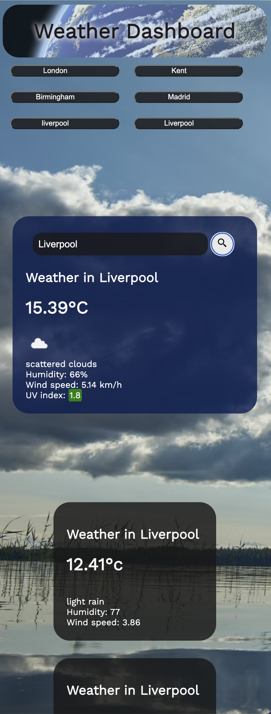

# weather-dashboard

## Description

An app designed to give the weather for multiple locations

## GitHub Links

https://github.com/Mattrix01/weather-dashboard/tree/dev

https://mattrix01.github.io/weather-dashboard/

## Technologies Used

- HTML
- CSS styling
- Flex-boxes
- CSS variables
- Animation
- APIs
- Javascript
- Variables
- String literals
- Event listeners
- Selectors
- Functions
- If statements

## Steps taken

- I started with a basic HTML structure, with place holder information which I will later fill in with string literals.

- I linked up and organsied all my files such as the styling and javscript

- I did some styling for my cards and fonts etc and made sure they flexed correctly

- I tinkered with the banner and mouse overs till I was happy

- I checked the responsiveness for smaller view ports

- I got my API key sorted and stored in a variable, and successfully retrieving data from it using a console.log test.

- I added some pseudo code to my jaavscript file to start laying out a plan

- I added and styled some forecast cards ready to eventually generate with javascript. Also set up a basic space for my history buttons I will generate.

- I got the weather displaying correctly on search on my main card

- Then fetching lang & long correctly

- I iterated through an array to get my results

- I fetched UV index correctly and set up an if statement to change styling according to results

- I got the forecast cards to fetch data and generate to the docuemnt using string literals

- I then set up storing searches into a local storage array

- I changed my class functions to normal functions as they were causing me some issues

- I succesfully had my history buttons generating onto document and recalling local storage correctly

- I did some final styling on my history buttons

- Finally, updated my README document and cleaned out any old files, deleted any pseudo code not needed and old HTML which was replaced with jaavscript. Sorted any more responsive issues and bugs.

## web page screenshot

